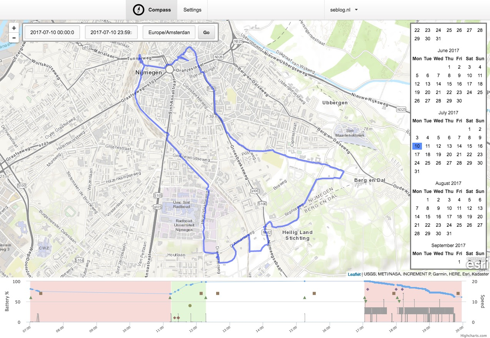

# Compass

Compass is a GPS tracking server that stores data in [flat files](https://github.com/aaronpk/QuartzDB).



## Requirements

* PHP 5.5 or above
* MySQL (for storing user accounts and lists of databases, not for storing the actual location data)

### PHP extensions

You'll need to make sure the following PHP extensions are installed. Typically these are installed using the package manager of your operating system.

* curl
* mbstring
* phpunit
* zip
* unzip

### Optional

* Redis (for the job queue, can use MySQL instead)


## Setup

Compass is built using the [Lumen framework](https://lumen.laravel.com/). If you have any trouble getting started, you can refer to the [Lumen documentation](https://lumen.laravel.com/docs/5.1) for tips that may have been skipped or assumed in these instructions.

In the `compass` directory, copy `.env.example` to `.env` and fill in the details. Install the dependencies with composer.

```
$ composer install
```

Once you've created the database and configured the settings in `.env`, run the migrations to set up all the tables.

```
$ php artisan migrate
```


### Web Server
Your web server will need to support URL re-routing to the index.php file of compass. This will vary based on your web server.

- If you're using Apache, this will involve URL re-writing likely using .htaccess
- If you're using Nginx, this will involve incorporating the following code into your server block, you should also add any applicable fastcgi settings inside the location block below:

```
try_files $uri /index.php?$args;

  location /index.php {
    fastcgi_param   SCRIPT_FILENAME $document_root$fastcgi_script_name;
  }
```

### Job Queue
For the job queue you will either need to have one of the supported options by Lumen. The two most likely options are an SQL database or Redis.
You can find other supported options [here](https://lumen.laravel.com/docs/5.1/queues#introduction)

If you're using the database queue driver (`QUEUE_DRIVER=database` defined in `.env`), you'll need to create the migration for that table:

```
$ php artisan queue:table
```

If you're using Redis, make sure you've installed the Redis server and set `QUEUE_DRIVER=redis`.

Make sure the storage folder you've defined in `STORAGE_DIR` is writable by the web server (or by the PHP process if you're using php-fpm).

To process jobs on the queue, run

```
$ php artisan queue:listen
```

For more details on how to configure this to run in the background, see https://lumen.laravel.com/docs/5.1/queues#running-the-queue-listener

## API

After you create a tracking database, you can visit the database's settings page to get a read or write token. These tokens are used with the API to update or retrieve data.

### Writing

To write to a database, make a POST request in JSON format with the following keys:

`POST /api/input`

* locations - a list of GeoJSON objects
* token - the write token for the database (as a query string parameter or in the post body)

The GeoJSON objects must have at least one property, "timestamp", which is can be any value that can be interpreted as a date. The object can have any additional properties you wish.

The open source iOS [GPS Logger](https://github.com/aaronpk/GPS-Logger-iOS) will send data in this format by default.

```
POST /api/input?token=XXXXXXX HTTP/1.1
Content-type: application/json

{
  "locations": [
    {
      "type": "Feature",
      "geometry": {
        "type": "Point",
        "coordinates": [-122.621, 45.535]
      },
      "properties": {
        "timestamp": "2017-01-01T10:00:00-0700",
        "horizontal_accuracy": 65
      }
    }
  ],
  "token": "XXXXXXX"
}
```


### Reading

To read a database, make a GET request as follows:

#### Get all data for a calendar day

`GET /api/query`

* token - (required) the read token for the database
* tz - (optional, default UTC) timezone string (e.g. America/Los_Angeles) which will be used to determine the absolute start/end times for the day
* format - (optional, default "full") either "full" or "linestring"
 * full - return one JSON record for each result in the database
 * linestring - combine all the returned results into a GeoJSON linestring
* date - specify a date to return all data on that day (YYYY-mm-dd format)

#### Get the last location before a given timestamp

`GET /api/last`

* token - (required) the read token for the database
* tz - (optional, default UTC) timezone string (e.g. America/Los_Angeles) which will be used to determine the absolute start/end times for the day
* before - (optional, default to now) specify a full timestamp to return a single record before this date (the point returned will be no more than 24 hours before the given date)
* geocode - (optional) if "true", then the location found will be reverse geocoded using [Atlas](https://atlas.p3k.io) to find the city and timezone at the location

#### Find the last location matching a clock time

`GET /api/find-from-localtime`

This API method can help you answer the question "Where was I when my watch read 9:30am on July 15th?".

Timestamps in Exif data do not include the timezone offset, and there is no standard mechanism for including the timezone offset in Exif. Some Canon cameras put the offset in a field, but not all of them do. You can use this method to find your location given an Exif date.

* token - (required) the read token for the database
* input - specify a clock time in the format `YYYY-mm-dd HH:MM:SS`

This will query the database and find the closest matching location for when your clock read that time.


## Credits

Compass icon by Ryan Spiering from the Noun Project.

Screenshot of the map view by Sebastiaan Andeweg.

## License

Copyright 2015 by Aaron Parecki

Compass is licensed under the [Apache 2.0 license](http://opensource.org/licenses/Apache-2.0)

Compass is built using the Lumen framework, which is licensed under the [MIT license](http://opensource.org/licenses/MIT)
